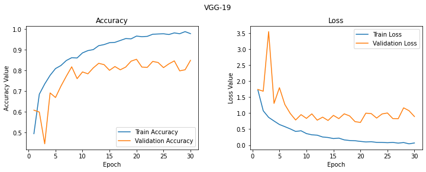
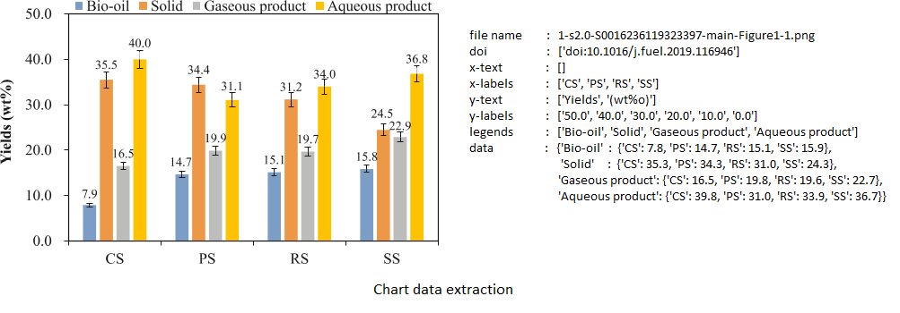

# ChartReader
Fully automated end-to-end framework to extract data from bar plots and other figures in scientific research papers using modules such as OpenCV, Tesseract.

## Image set
Bar plots used are here: https://drive.google.com/drive/u/1/folders/154sgx3M49NoKOoOjoppsSuvqd2WzqZqX

## Chart classification (Accuracy: 84.01%)
### Training data preparation
<b> Step 1: </b> ``google_images_download`` python module is used to download google images for each type of chart: Area chart, Line chart, bar plot, pie chart, venn diagram etc. based on their corresponding keywords.

```
$ git clone https://github.com/Joeclinton1/google-images-download.git
$ cd google-images-download && python setup.py install
```

<b> Step 2: </b> The downloaded images are carefully reviewed and the incorrect images are removed.

The following are the training data used, and model files.
<br>training corpus: https://drive.google.com/drive/u/1/folders/1M8kwdQE7bpjpdT08ldBURFdzLaQR9n5h
<br>model: https://drive.google.com/drive/u/1/folders/1GVW_MtFFYT-Tj44p0_QLKM7hVnn_AcKI

Below is the count of images for each type:
<table>
<tr>
<td>

| Plot type     | Count         |
| ------------- |:-------------:|
| BarGraph      |   528         |
| VennDiagram   |   364         |
| PieChart      |   355         |

</td>
<td>

| Plot type     | Count         |
| ------------- |:-------------:|
| TreeDiagram   |   297         |
| FlowChart     |   293         |
| Map           |   276         |

</td>
<td>

| Plot type     | Count         |
| ------------- |:-------------:|
| BubbleChart   |   311         |
| LineGraph     |   300         |
| AreaGraph     |   299         |

</td>
<td>

| Plot type     | Count         |
| ------------- |:-------------:|
| ScatterGraph  |   335         |
| ParetoChart   |   329         |
| NetworkDiagram|   321         |
| BoxPlot       |   312         |

</td>
</tr>
</table>

### Training and results:
pretrained model VGG19 is used to train the images, and is run on the test images to classify the images to 13 different types such as Bar chart, Line graph, Pie chart etc.

The accuracy is calculated using stratified five-fold cross validation. The accuracy of the model is ``84.01%``. The following are the training accuracy and loss curves captured during the training phase for each fold of cross validation.

<h3 align="center">
  
</h3>

<h3 align="center">
  
</h3>

<h3 align="center">
  
</h3>

<h3 align="center">
  
</h3>

<h3 align="center">
  
</h3>

## Axes Detection
1. Firstly, the image is converted into bw image (black and white), then the max-continuous ones along each row and each column are obtained.
2. Next, for all columns, the maximum value of the max-continuous 1s is picked.
3. A certain threshold (=10) is assumed, and the first column where the max-continuous 1s falls in the region [max - threshold, max + threshold] is the y-axis.
4. Similar approach is followed for the x-axis, but the last row is picked where the max-continuous 1s fall in the region [max - threshold, max + threshold]

<h3 align="center">
  
</h3>
<h3 align="center">
  
</h3>

## Text detection
Pytesseract python module is used to detect text from the images.
Tesseract is now run on this image to get the bounding boxes for the text. 
An option of `bw` is provided. When this is `True`, then since the text would be in black, the image is converted to HSV and only the black color is filtered. But this leads to inaccurate text. Hence whiten the original image except these bounding boxes and run tesseract again to get the text. The difference between bounding boxes on actual image and the HSV image is shown below.

Bounding boxes for normal image.

<h3 align="center">
  
</h3>

Bounding boxes when `bw` is set to `True`.

<h3 align="center">
  
</h3>

## Number detection (using tesseract)
Use the config `-l eng --oem 1 --psm 6 -c tessedit_char_whitelist=.0123456789` to detect only numbers using tesseract. Note that through the experiments, it is observed that psm mode 6 works better than other psm modes for numerical value detection. Below shows the comparision with psm modes 11 and 6.

<h3 align="center">
  
</h3>

We can see that, with `psm mode 11`, the numbers 90, 60, 40 and 0 are missed (or detected as non-numeric text), whereas with `psm mode 6`, these are detected as numeric values.

## Label Detection
### X-labels:
1. Filter the text boxes which are below the x-axis(, and to the right of y-axis).
2. Run a sweeping line from x-axis to the bottom of the image, and check when the sweeping line intersects with the maximum number of text boxes.
3. This maximum intersection gives all the bounding boxes for all the x-labels.
    


### Y-labels:
1. Run a sweeping line in the reverse direction, i.e., y-axis and start moving towards the left. Stop when the line has all white pixels (This makes sure you have crossed the ticks)
2. Process the image with the following steps:

    a. Convert to binary image (black and white), using OTSU threshold

    b. Use a rectangle kernel of (1, 15) and apply morphological operations
    
    c. Use a rectangle kernel of (5, 1) and apply morphological operations
    
    d. Run a contour detection using opencv and get the bounding rectangles
3. Run a sweeping line from y-axis and start moving towards the left, and check when the sweeping line intersects with the maximum number of text boxes.
4. Whiten the image and keep only these text boxes where there was maximum intersection.
5. Run tesseract to detect only numeric values.

### Y-axis text:
1. Pick the whitened image above, and whiten the bounding boxes for the numeric y-labels detected above.
2. Rotate the image by 90 degree, since the text on y-axis would be vertical.
3. Run tesseract to get the text

<h3 align="center">
  
</h3>

## Label detection/finalization
For each bounding rectangle obtained, it is checked whether there is a text box to the immediate right of the rectangle.

### Legend text: 
The immediate rectangle to the right gives the corresponding legend.

## Cluster count estimation
1. This is done by determining the number of items in the legend.
2. Check only the text boxes right to the y-axis and top of x-axis
3. Filter further by considering text boxes which have non-numeric text
4. Run the sweeping line algorithm twice now - Once in the x-direction and the second time in the y-direction (because the legends can be stacked in the x-direction or y-direction)
5. The maximum intersection gives all the legend texts and the number of legends.
6. Now, these rectangles (or bounding boxes) are merged. The final number of rectangles gives the number of legends and the image colors are clustered into these many groups.

## Color detection
1. All the pixel values of the image are divided into clusters. The number of clusters are determined by the above described procedure. Also, prior to clustering, all the white pixels are removed.
2. We then simplify the given plot into multiple plots (one per each cluster). These plots would be a simple bar plot. i.e.., by clustering we convert a stacked bar chart into multiple simpler bar plots.
3. We then get the contours for the plot, and subsequently bounding rectangles for the contours determined.
The noise is removed by determining if the number of bounding rectangles are either 0 or abnormally high.

## Data extraction
### Value-tick ratio calculation: 
This ratio is used to calculate the y-values from each bar-plot using the pixel projection method. Y-axis ticks are detected by left-bounding boxes to the y-axis.

Since the text detection (numeric values) isn't perfect, once the pixel values for the ticks and actual y-label texts are obtained, the outliers are removed by assuming a normal distribution and whether the values deviate very much. Then, the mean distance between the ticks is calculated. Further, the mean value of the actual y-label ticks is calculated. Finally, the value-tick ratio is calculated by ``normalize_ratio := ticks_diff.mean() / y-ticks.mean()``.

The height of each bounding box is recorded by the help of the merging rectangles during Cluster count estimation method. This ratio is then used to calculate the ``y_values :=  v_value = normalize_ratio x height of bounding box``.

Below shows data extraction results on an image.

<h3 align="center">
  
</h3>

Note that the highlighted numbers (in red) are related to the legend related bounding boxes and WIP to be further processed and removed.

## Reporting results
The results (axes, legends, labels, values, captions and file-names) are written to the Excel sheet.
