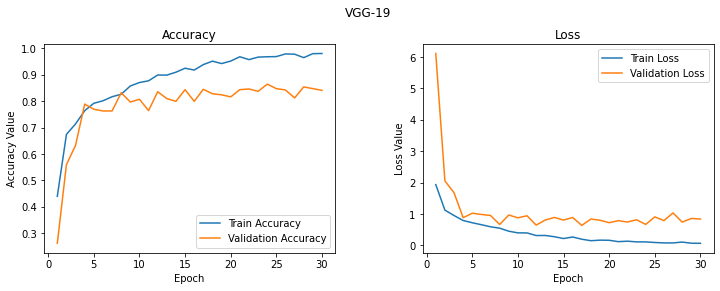
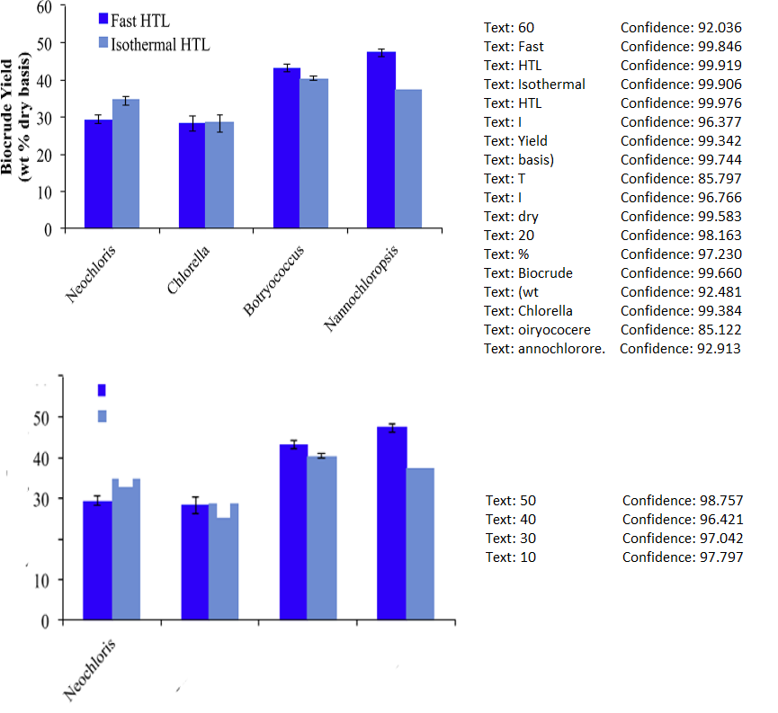

# ChartReader
Fully automated end-to-end framework to extract data from bar plots and other figures in scientific research papers using modules such as OpenCV, AWS-Rekognition for text detection in images.

## Figure extraction
pdffigures2 is used to extract/download images (charts + tables) from the research papers.

## Image set
Bar plots used are here: https://drive.google.com/drive/u/1/folders/154sgx3M49NoKOoOjoppsSuvqd2WzqZqX

## Chart classification (Accuracy: 84.08%)
### Data preparation
<b> Step 1: </b> ``google_images_download`` python module is used to download google images for each type of chart: Area chart, Line chart, bar plot, pie chart, venn diagram etc. based on their corresponding keywords.

```
$ git clone https://github.com/Joeclinton1/google-images-download.git
$ cd google-images-download && python setup.py install
```

<b> Step 2: </b> The downloaded images are carefully reviewed and the incorrect images are removed.

The following are the training data used, and model files.
<br>training corpus: https://drive.google.com/drive/u/1/folders/1M8kwdQE7bpjpdT08ldBURFdzLaQR9n5h
<br>model: https://drive.google.com/drive/u/1/folders/1GVW_MtFFYT-Tj44p0_QLKM7hVnn_AcKI

Below is the count of images for each type:
<table>
<tr>
<td>

| Plot type     | Count         |
| ------------- |:-------------:|
| BarGraph      |   528         |
| VennDiagram   |   364         |
| PieChart      |   355         |
| ScatterGraph  |   335         |

</td>
<td>

| Plot type     | Count         |
| ------------- |:-------------:|
| TreeDiagram   |   297         |
| FlowChart     |   293         |
| Map           |   276         |
| ParetoChart   |   329         |

</td>
<td>

| Plot type     | Count         |
| ------------- |:-------------:|
| BubbleChart   |   311         |
| LineGraph     |   300         |
| AreaGraph     |   299         |
| NetworkDiagram|   321         |
| BoxPlot       |   312         |

</td>
</tr>
</table>

### Training phase:
pretrained models VGG-19, ResNet152V2, InceptionV3, EfficientNetB3 are used to train the images, and is run on the test images to classify the images to 13 different types such as Bar chart, Line graph, Pie chart etc.

The accuracy is calculated using stratified five-fold cross validation. The accuracy of the models are given below in the table. We see that the accuracy is around 84% for all the models used to train the data. The following are the training accuracy and loss curves captured during the training phase for each fold of cross validation.

<table>
  <tr>
    <td>Model</td>
    <td>Training parameters</td>
    <td>Accuracy</td>
  </tr>
  <tr>
    <td>VGG-19</td>
    <td>47,736,845</td>
    <td>84.08% (+/- 0.49%)</td>
  </tr>
  <tr>
    <td>ResNet152V2</td>
    <td>143,428,621</td>
    <td>83.54% (+/- 1.19%)</td>
  </tr>
  <tr>
    <td>InceptionV3</td>
    <td>91,358,605</td>
    <td>84.53% (+/- 1.61%)</td>
  </tr>
  <tr>
    <td>EfficientNetB3</td>
    <td>107,331,693</td>
    <td>84.53% (+/- 0.92%)</td>
  </tr>
</table>

<h3 align="center">
  
</h3>

<h3 align="center">
  
</h3>

<h3 align="center">
  
</h3>

<h3 align="center">
  
</h3>

<h3 align="center">
  
</h3>

### Results (predictions on test data)
The following are 100 randonly picked images which are predicted as bar plots. Highlighted images (6 in number out of 100 randomly picked) are incorrectly classified as bar plots.

<h3 align="center">
  
</h3>

## Axes Detection (Accuracy: 80.22%) [1006/1254 correct]
1. Firstly, the image is converted into black and white image, then the max-continuous ones along each row and each column are obtained.
2. Next, for all columns, the maximum value of the max-continuous 1s is picked.
3. A certain threshold (=10) is assumed, and the first column where the max-continuous 1s falls in the region [max - threshold, max + threshold] is the y-axis.
4. Similar approach is followed for the x-axis, but the last row is picked where the max-continuous 1s fall in the region [max - threshold, max + threshold]


We experimented with threshold values of 0, 5, 10, 12 and found that threshold value of 10 gives better results for axes detection. Table below shows the accuracy of axes detection with varying threshold values.

<table>
  <tr>
    <td>Threshold</td>
    <td>0</td>
    <td>5</td>
    <td>10</td>
    <td>12</td>
  </tr>
  <tr>
    <td>Accuracy (%)</td>
    <td>73.2</td>
    <td>78.8</td>
    <td>80.22</td>
    <td>79.26</td>
  </tr>
</table>

<h3 align="center">
  
</h3>
<h3 align="center">
  
</h3>

### Results
Both x and y axes are detected correctly for 1006 images out of 1254 images (test data set). Below are some of the failed cases in axes detection.

<h3 align="center">
  
</h3>

## Text detection
AWS-Rekognition is used to detect text in the image. [DetectText](https://docs.aws.amazon.com/rekognition/latest/dg/API_DetectText.html) API is used for detecting text. Only the text with confidence >= 80 are considered.

### Double-pass algorithm for text detection
To improve text detection, double-pass algorithm is employed.
1. Text detection using detect_text AWS Rekognition API, and considered only the text boxes for which confidence >= 80
2. Fill the polygons corresponding to these text with white color
3. Run text detection (2nd pass) on the new image, and consider only the ones with confidence >= 80

<h3 align="center">
  
</h3>

### Bounding Box calculation
There is an [issue](https://forums.aws.amazon.com/thread.jspa?threadID=325482&tstart=0) with bounding box for vertical text or text with an angle. Therefore, bounding box is calculated from the polygon coordinates (or vertices) from the AWS Rekognition output. 

## Label Detection
### X-labels:
1. Filter the text boxes which are below the x-axis(, and to the right of y-axis).
2. Run a sweeping line from x-axis (detected by axes detection algorithm) to the bottom of the image, and check when the sweeping line intersects with the maximum number of text boxes.
3. This maximum intersection gives the bounding boxes for all of the x-labels.
    


### X-text
1. Filter the text boxes which are below the x-labels
2. Run a sweeping line from x-labels to the bottom of the image, and check when the sweeping line intersects with the maximum number of text boxes.
3. This maximum intersection gives all the bounding boxes for all the x-text.

### Y-labels:
1. Filter the text boxes which are to the left of y-axis.
2. Run a sweeping line from y-axis and start moving towards the left, and check when the sweeping line intersects with the maximum number of text boxes.
3. Pick these text boxes where there was maximum intersection, and filter them further using python regex to detect only numeric values.

### Y-text:
1. Filter the text boxes which are to the left of y-axis.
2. The remaining text boxes that are not classified as y-labels will be considered as y-text.

## Legend detection
1. Filter the text boxes that are above the x-axis, and to the right of y-axis.
2. Clean the text to remove 'I'. These are obtained since error bars in the charts are detected as 'I' by AWS Rekognition OCR API(s).
3. Use an appropriate regex to disregard the numerical values. These are mostly the ones which are there on top of the bars to denote the bar value.
4. Now merge the remaining text boxes (with x-value threshold of 10) to make sure all the multi-word legends are part of a single bounding box.
5. Group bounding-boxes in such a way that each member in the group is either horizontally or vertically aligned to atleast one other member in the group.
6. The maximum length group from all the groups obtained in Step 5 gives the bounding boxes for all the legends.
7. Legend text can be parsed and obtained from these bounding boxes.

## Data extraction
### Value-tick ratio calculation: 
This ratio is used to calculate the y-values from each bar-plot using the pixel projection method. Y-axis ticks are detected by left-bounding boxes to the y-axis.

Since the text detection (numeric values) isn't perfect, once the pixel values for the ticks and actual y-label texts are obtained, the outliers are removed by assuming a normal distribution and whether the values deviate very much. Then, the mean distance between the ticks is calculated. Further, the mean value of the actual y-label ticks is calculated. Finally, the value-tick ratio is calculated by:

<h3 align="center">
  
</h3>

### Pattern (or color) estimation
1. As an initial step, all the bounding boxes for the text in the image are whitened.
2. Convert the resulting image into a binary image.
3. Find contours (and bounding rectangles) in the resulting image.
4. For each legend, find the nearest bounding box to the left and on the same height as the legend.
5. Now in the original image, find the major color (or pattern) from the nearest bounding box obtained for each legend in Step 4.

### Getting bar plot for each legend
1. All the pixel values of the image are divided into clusters. Prior to clustering, all the white pixels are removed, and the bounding boxes found by above procedure for each legend are whitened. 
2. The number of clusters are determined by the number of legends detected. The colors finalized in the above procedure form the initial clusters.
3. We then simplify the given plot into multiple plots (one per each cluster). These plots would be a simple bar plot. i.e.., by clustering we convert a stacked bar chart into multiple simpler bar plots.
4. We then get the contours for the plot, and subsequently bounding rectangles for the contours determined.
5. For each label, the closest bounding rectangle is picked.
6. The height of each bounding box is recorded by the help of the merging rectangles obtained by the above procedure. This ratio is used to further calculate the y-values :

<h3 align="center">
  
</h3>

Below shows data extraction results on an image.

<h3 align="center">
  
</h3>

## Reporting results
The results (axes, legends, labels, values, captions and file-names) are written to the Excel sheet.

Table below shows the evaluation metrics.

<table>
  <tr>
    <td>Parameter</td>
    <td>Accuracy</td>
    <td>True Positive Rate</td>
  </tr>
  <tr>
    <td>Legends</td>
    <td>0.8054</td>
    <td>0.8054</td>
  </tr>
  <tr>
    <td>X-axis ticks</td>
    <td>0.9755</td>
    <td>0.9755</td>
  </tr>
  <tr>
    <td>Y-axis ticks</td>
    <td>0.6815</td>
    <td>0.6815</td>
  </tr>
  <tr>
    <td>height/value ratio</td>
    <td>0.8919</td>
    <td>0.8919</td>
  </tr>
  <tr>
    <td>Y-axis label</td>
    <td>0.7758</td>
    <td>0.7758</td>
  </tr>
  <tr>
    <td>X-axis label</td>
    <td>0.7129</td>
    <td>0.7129</td>
  </tr>
  <tr>
    <td>Data correlation</td>
    <td>0.6470</td>
    <td>0.7504</td>
  </tr>
  <tr>
    <td>Data values</td>
    <td>0.2158</td>
    <td>0.4095</td>
  </tr>
</table>
